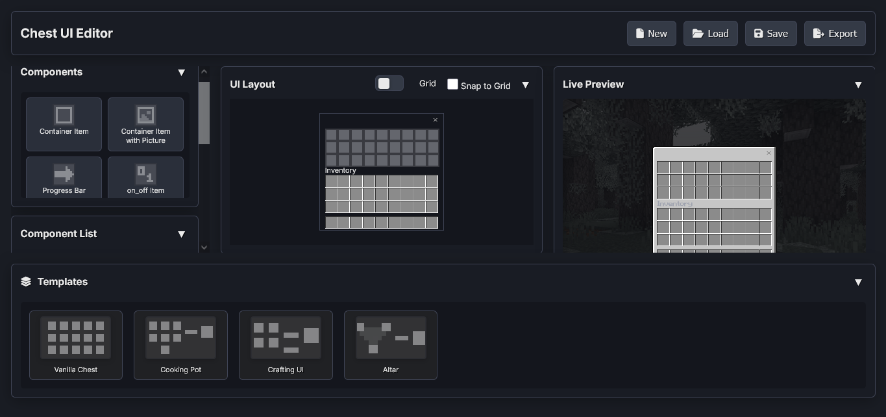

# Minecraft Bedrock Chest UI Editor

A web-based editor for creating custom chest UIs for Minecraft Bedrock Edition. Design interactive interfaces with drag-and-drop components and export them as resource packs.

## Features

- Drag and drop interface for UI component placement
- Live preview of your chest UI design
- Several pre-built templates
- Local storage to save your projects
- Export to ready-to-use Minecraft resource packs

## Components

The editor provides several types of components that can be added to your chest UI:

### Draggable Components

1. **Container Item**
   - Standard inventory slot for item placement
   - Properties: Collection index, position, size
   - Used for regular item slots in your UI

2. **Container Item with Picture**
   - An inventory slot with a custom background image
   - Properties: Collection index, picture path, position, size
   - Useful for specialized slots (e.g., book slots, special crafting inputs)

3. **Progress Bar**
   - Visual indicator for cooking/crafting progress
   - Properties: Collection index, current value, position
   - Can be used to show progress of crafting, smelting, etc.
   - The Progress can be controlled by renaming the item in this slot to 0-9, 0 is an empty bar while 9 is full.
   (It is recommended to use an unobtainable item in this slot to avoid the player shift click placing an item there)

4. **On/Off Item**
   - Toggle switch for binary states
   - Properties: Collection index, active state, position
   - Useful for switches that toggle functionality, The state can be controlled by renaming the item in this slot to 1 for on and anything else for off.
   (It is recommended to use an unobtainable item in this slot to avoid the player shift click placing an item there)

5. **Un-intractable Slot**
   - Visual-only slot that players can't interact with
   - Properties: Collection index, position
   - Used for decorative elements or visual guides
   (It is recommended to rename any item displayed here to a random name to avoid the player shift click placing a similar item there)

6. **Container Type**
   - Standard inventory slot with dynamic background picture.
   - Used for custom slots that change appearance based on item in slot.
   - Properties: Collection index, position, size
   - The background picture will change based on the name of the item in the slot 0-9.
   (It is recommended to use an unobtainable item in this slot to avoid the player shift click placing an item there)

7. **Image**
   - Static decorative image
   - Properties: Texture path, alpha (transparency), position, size
   - Used for adding visual elements like backgrounds or decorations

8. **Label**
   - Text element
   - Properties: Text content, color, position
   - Used for titles, descriptions or instructions

## Usage

1. **Adding Components:**
   - Drag components from the left sidebar onto the chest UI area
   - Each component can be positioned precisely using the Properties panel

2. **Editing Properties:**
   - Select any component to edit its properties in the Properties panel
   - Properties include position, size, text content, colors, etc.

3. **Saving & Loading:**
   - Use the Save button to store your project in the browser's local storage
   - Load previously saved projects with the Load button

4. **Exporting:**
   - Click Export to generate a Minecraft Bedrock resource pack (.zip)
   - The resource pack includes all necessary textures and UI definition files

5. **In game usage:**
   - Make a custom entity with an inventory that have the same slots size as your UI. (optional, vanilla containers can be used)
   - Spawn the entity with the name '§t§e§s§t§r' to see the UI. 
   - Control the Ui behavior using Script API

## Credits

- Created by minato4743.
- Uses JSZip library for ZIP file generation
- [Blockstate Team](https://blockstate.team) for the use of there cooking pot UI from [furniture-venture-v2](https://blockstate.team/projects/furniture-venture-v2). (Originally from [farmer's delight](https://modrinth.com/mod/farmers-delight) cooking pot).